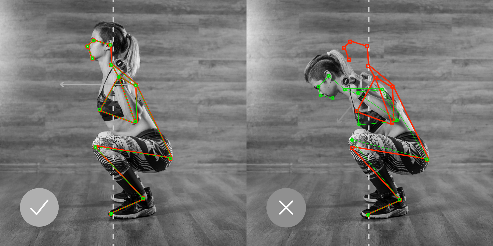

# Gym coach AI assistant.
#AndroidDevChallenge
## Tell us what your idea is.

Nowadays, sport became an inalienable part of our life. Excellent physical condition is directly correlated with career achievements. The desire to be stronger and more resilient stimulates people to include exercise in their daily schedule and transform it into a habit. A common practice in this scenario is paying for some coaching services. The main problem here is that fact that such a coaching program usually is not that cheap. Such a price issue is even worse in low-income countries. So, in case, if someone doesn’t have enough budget for paying the coacher, there is another problem in this way. Even a simple exercise as squats can be performed incorrectly: tear off the heels from the ground, bend your back. And for more difficult exercise with some of the sports equipment, a potential health problem could appear in case of incorrectly performing.
The main target of our team is to make fitness exercises more affordable for people who don’t have the ability to pay for their coaching programs. We want to combine the availability of Android devices and modern machine learning and machine vision technologies, to create a system that can significantly help people who can’t afford to pay for fitness coaching programs. The application will use a device camera for fitness activity tracking and displaying the progress on a screen in comparing with the proper way how fitness exercises must be done.

## Tell us how you plan on bringing it to life. 

The System consists of next components:
1. - Raspberry Pi Model B with Android Things onboard.
2. - Android application with an integrated TensorFlow Light model.
3. - Two USB cameras. One is using as a frontal camera and the second one as a side-view camera.
4. - HDMI connection between Raspberry Pi and TV screen 
5. - TV screen  

The system will use the Raspberry Pi Model B with Android Things onboard. Two USB cameras connected to the Raspberry Pi will be used for the user's activity tracking. One if for tracking information about frontal progress, and another one for side view tracking. Information from those two cameras will be processing by Android application with TensorFlow model.  
The idea is to use TensorFlow for making image size invariant model, which will be able to recognize user movements during the exercise and compare it with correct patterns. The output model should consist of several sublayers. The first one, based on the PoseNet library will be used for the pose estimation of the user. All other layers going to use mostly for recognition of how far or close the user’s body pose from proper pose for specific exercise based on that pose estimation info. At the final stage, we are going to use TensorFlow Converter for making TensorFlow Lite file which will be built-in into the Android app. In this case, the Android application will use two video streams form two USB cameras, for tracking how exercises are going and displaying results on the TV screen via HDMI connection. So, the user can see how to perform the exercise correctly in real-time. 
The examples, how it will look like from the user's point of view would be shown in the following pictures.

1. Examples of correct (left image) and incorrect (right) exercise performing which is racking by the front camera.

2. Examples of correct (left image) and incorrect (right) exercise performing which is racking by the side-view camera.

Last, but not least, is that fact that this application can work offline, shouldn’t worry about connectivity, which could also save the user's budget. 
The core functionality of the system could also be improved by adding a voice assistant to correct the execution of exercises.

## Tell us about you.

In the middle of 2019, we have organized the team whose main purpose is making experiments in the intersection between Machine learning technologies and some of the use cases from real life. We are focusing on making simple software prototypes, which could show people how some of their everyday activities could be improved by using modern Artificial intelligent technologies that people could play with them a bit. The main idea is finding new ways of how Artificial intelligence could help people make their lives better. 

For now, our small team consists only of two people:

[Anton Valiukh](https://ua.linkedin.com/in/valiuh) and [Artem Garkusha](https://nl.linkedin.com/in/artemgarkusha)

But that fact, that we have a vision, that Artificial Intelligence and Machine learning could not just cover some business use cases, but also make the world a better way, give us confidence that we will be grooving in the future by finding new people who will join our team. 
